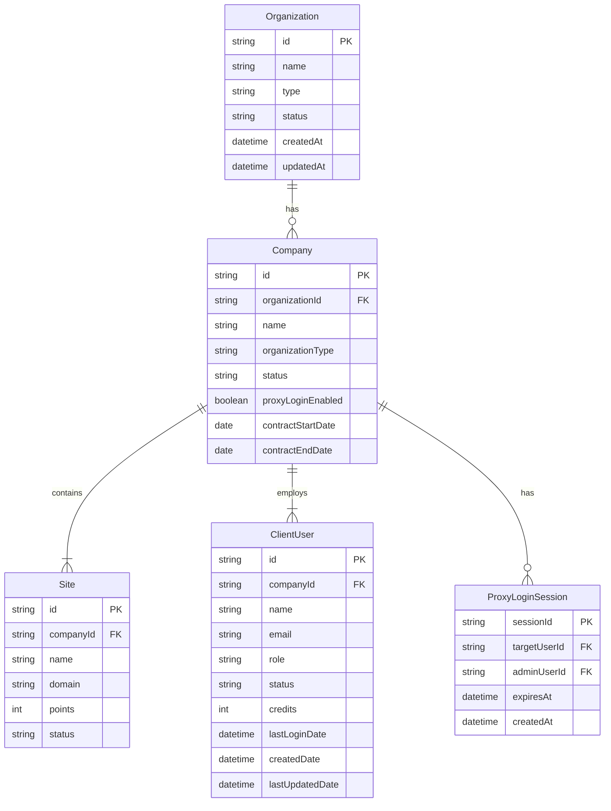
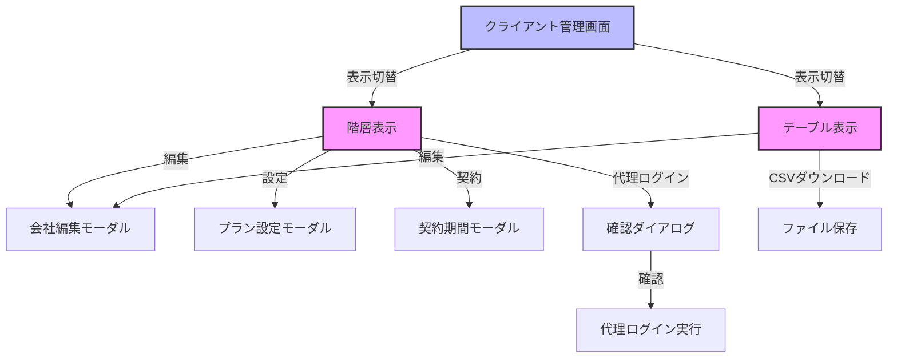
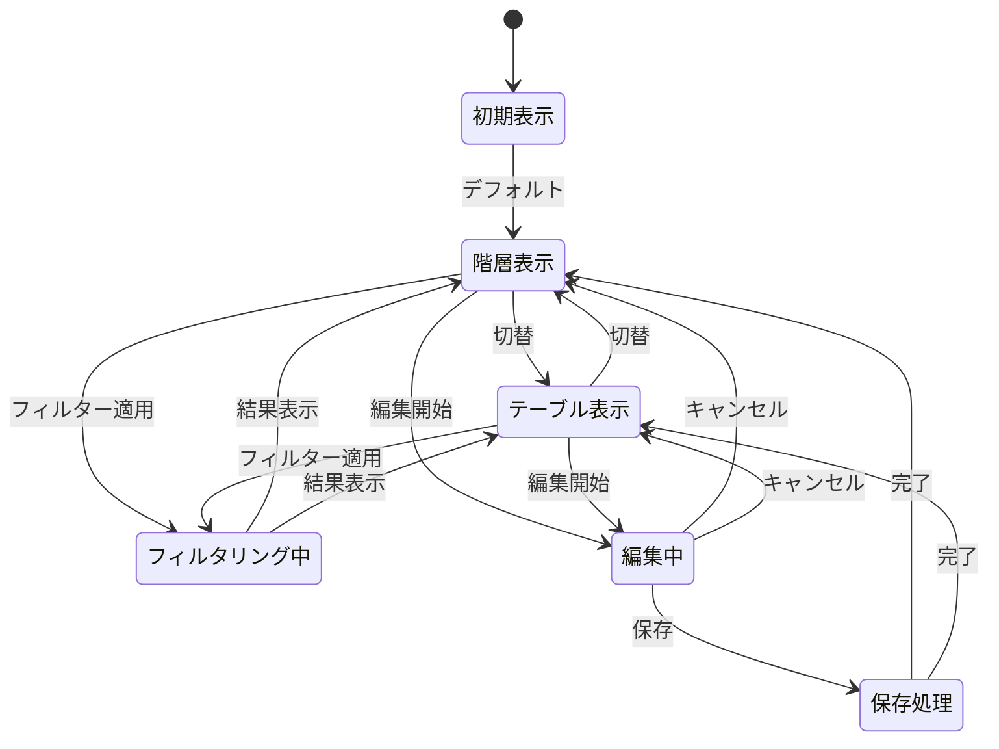
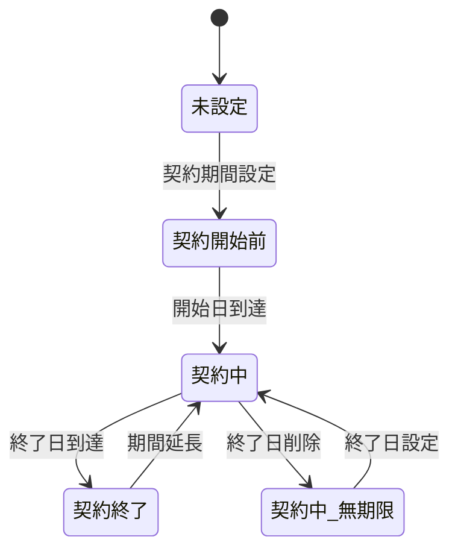
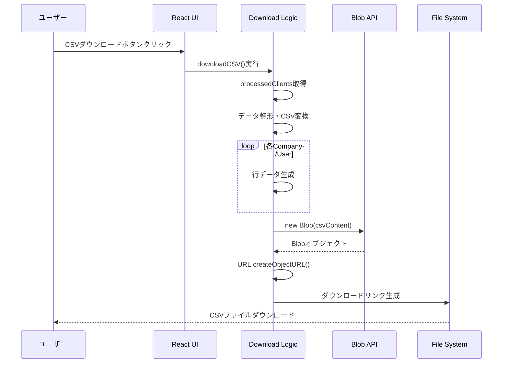
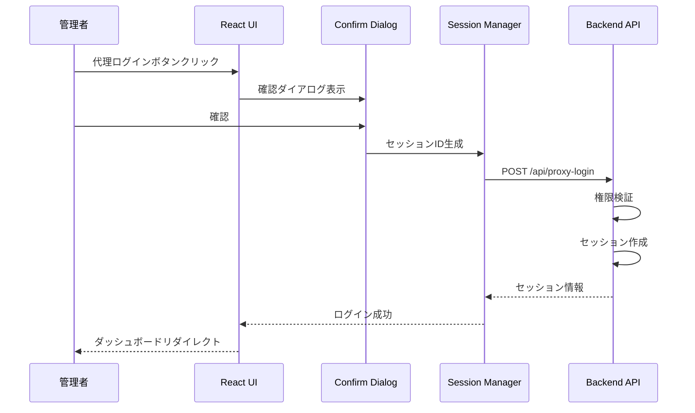
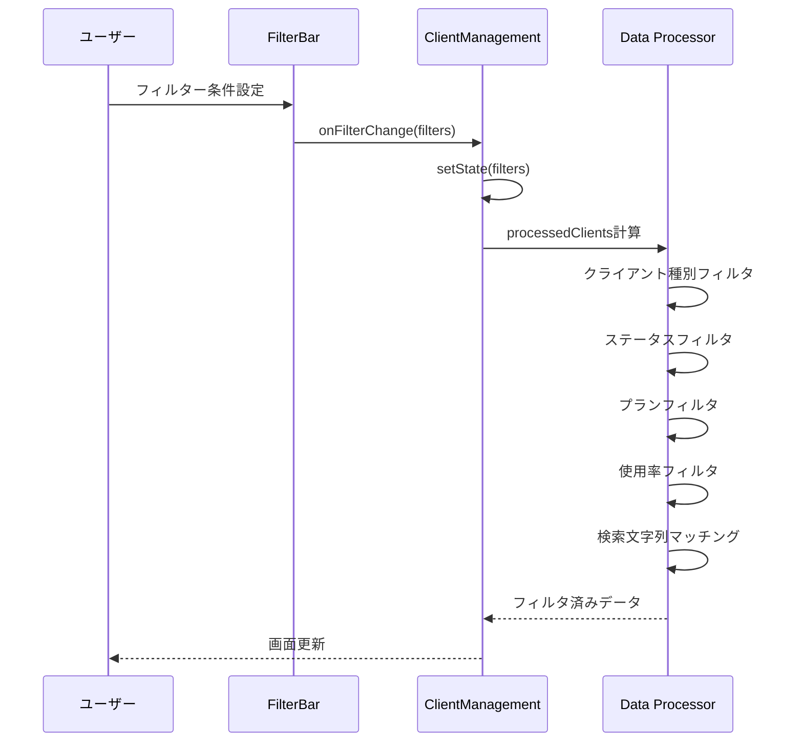
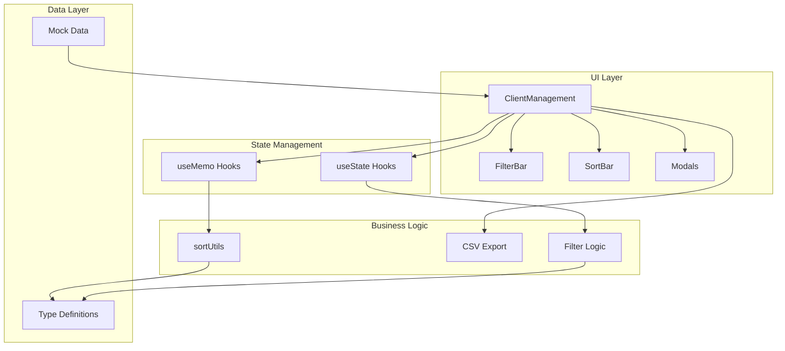
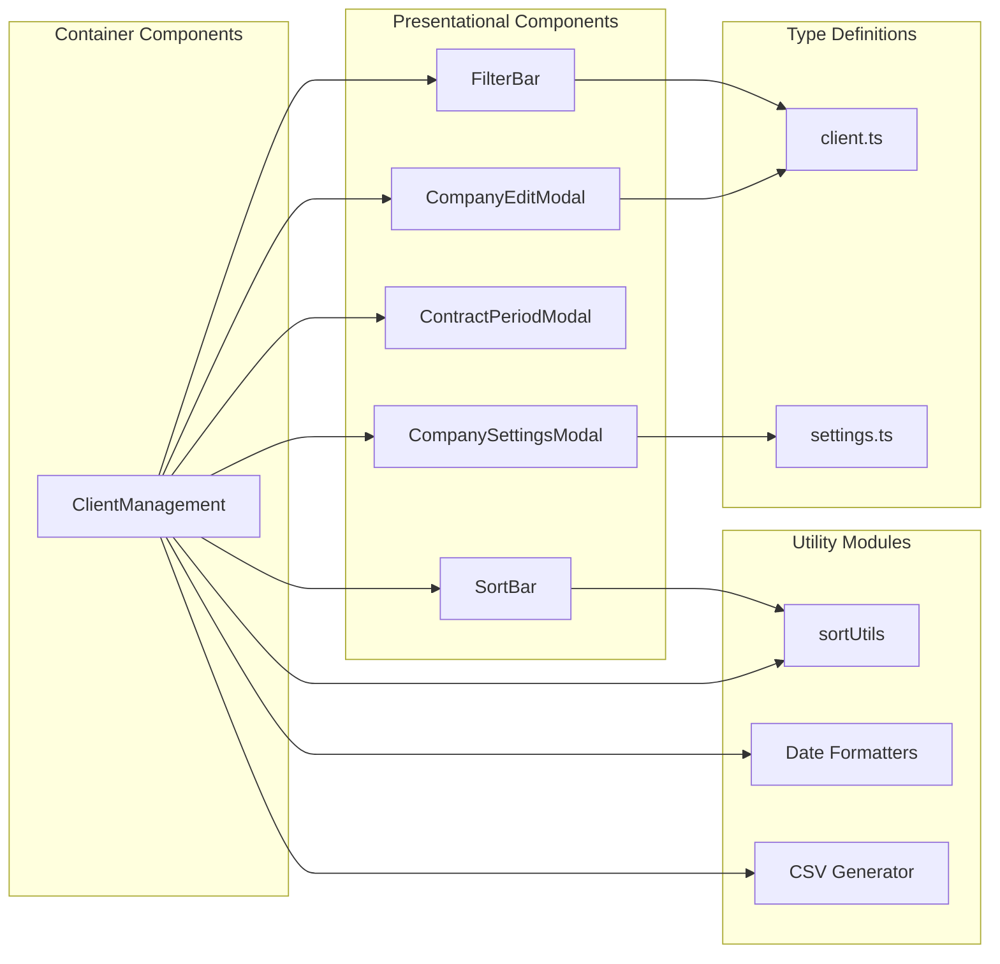

# クライアント管理システム要件定義書

## 1. 概要

### 1.1 目的と背景
- **プロジェクトの背景**: 複数の代理店とクライアントを階層的に管理する必要性
- **解決したい課題**: 
  - 代理店経由・直接契約の混在管理
  - リソース使用状況の可視化
  - 顧客サポートの効率化
- **期待される効果**:
  - 統合的な顧客管理の実現
  - 使用率監視による適切なリソース配分
  - 代理ログインによるサポート業務の迅速化

### 1.2 スコープ
- **対象範囲**:
  - 組織・会社・サイト・ユーザーの階層管理
  - 契約・プラン管理
  - 使用率監視とアラート
  - CSVエクスポート機能
- **対象外範囲**:
  - 請求・決済処理
  - 外部システムとのAPI連携
  - 自動化されたリソース割当
- **前提条件**:
  - React/TypeScriptベースのSPA
  - ブラウザベースの管理画面

### 1.3 用語定義
| 用語 | 説明 |
|-----|------|
| Organization | 最上位の組織単位（代理店または直接クライアント） |
| Company | 組織配下の会社またはプロジェクト単位 |
| Site | 会社が管理するWebサイト |
| ClientUser | システムを利用するユーザー |
| 代理ログイン | 管理者が他ユーザーとしてログインする機能 |
| 使用率 | リソース制限に対する現在の使用量の割合 |

## 2. 機能要件

### 2.1 ユーザーストーリー
- As a **Chipper社員**, I want to **全組織を統合管理**できる, so that **効率的な顧客サポートが提供できる**
- As a **代理店管理者**, I want to **配下のクライアントを一元管理**できる, so that **複数顧客の状況を把握できる**
- As a **企業管理者**, I want to **自社のリソース使用状況を確認**できる, so that **適切なプラン選択ができる**

### 2.2 機能一覧
| ID | 機能名 | 説明 | 優先度 |
|----|--------|------|--------|
| F001 | 階層表示 | 組織構造を階層的に表示・操作 | 高 |
| F002 | テーブル表示 | フラットなテーブル形式での一覧表示 | 高 |
| F003 | 検索・フィルタリング | 多条件での絞り込み検索 | 高 |
| F004 | ソート機能 | 複数項目でのソート | 中 |
| F005 | CSVエクスポート | データのCSV形式ダウンロード | 中 |
| F006 | 代理ログイン | 他ユーザーとしてのログイン | 高 |
| F007 | 契約期間管理 | 契約期間の設定・監視 | 中 |
| F008 | 使用率監視 | リソース使用率の可視化 | 高 |

### 2.3 機能詳細

#### F001: 階層表示
- **概要**: 組織→会社→サイト→ユーザーの階層構造表示
- **入力**: 展開/折りたたみ操作
- **処理**: 階層データの動的レンダリング
- **出力**: ツリー構造のUI表示
- **バリデーション**: なし
- **エラー処理**: データ取得エラー時のフォールバック表示

#### F002: テーブル表示
- **概要**: 全会社をフラットなテーブル形式で一覧表示
- **入力**: 表示切替ボタンクリック
- **処理**: データのフラット化と表形式レンダリング
- **出力**: 13カラムのテーブル表示
- **バリデーション**: なし
- **エラー処理**: データ不整合時の空欄表示

#### F003: 検索・フィルタリング
- **概要**: 複数条件での絞り込み検索
- **入力**: 
  - 検索文字列
  - フィルター条件選択
- **処理**: 
  - 全文検索（クライアント名、会社名、サイト名、ユーザー名、メールアドレス）
  - 条件フィルタリング
- **出力**: 絞り込まれたデータ表示
- **バリデーション**: 
  - 使用率の範囲チェック（0-100%）
- **エラー処理**: 該当データなし時のメッセージ表示

#### F004: ソート機能
- **概要**: 各種項目でのソート
- **入力**: ソート項目選択、昇順/降順切替
- **処理**: 
  - 文字列比較（日本語ロケール対応）
  - 数値比較
  - 日時比較
  - 優先順位による比較
- **出力**: ソート済みデータ表示
- **バリデーション**: なし
- **エラー処理**: ソート失敗時は元の順序を維持

#### F005: CSVエクスポート
- **概要**: 管理データのCSV形式エクスポート
- **入力**: ダウンロードボタンクリック
- **処理**: 
  - 現在の表示データを収集
  - CSV形式に変換
  - UTF-8 BOM付きエンコーディング
- **出力**: client_users_YYYY-MM-DD.csv
- **バリデーション**: データ存在チェック
- **エラー処理**: エクスポート失敗時のアラート表示

#### F006: 代理ログイン
- **概要**: 管理者が他ユーザーとしてログイン
- **入力**: 代理ログインボタンクリック
- **処理**: 
  - 権限確認
  - セッションID生成
  - ログイン処理
- **出力**: 対象ユーザーのダッシュボード表示
- **バリデーション**: 
  - 代理ログイン有効フラグ確認
  - 権限チェック
- **エラー処理**: 権限不足時のエラーメッセージ

#### F007: 契約期間管理
- **概要**: 契約期間の設定と状態管理
- **入力**: 開始日・終了日の入力
- **処理**: 
  - 契約状態の判定
  - ステータス更新
- **出力**: 契約状態の表示更新
- **バリデーション**: 
  - 日付の妥当性チェック
  - 開始日 < 終了日の確認
- **エラー処理**: 不正な日付入力時のエラー表示

#### F008: 使用率監視
- **概要**: リソース使用率の可視化と警告
- **入力**: なし（自動計算）
- **処理**: 
  - 使用率計算: (使用量 / 制限量) × 100
  - しきい値判定
- **出力**: 
  - パーセンテージ表示
  - 色分け表示（緑/黄/赤）
- **バリデーション**: ゼロ除算チェック
- **エラー処理**: 計算不能時は「-」表示

## 3. 非機能要件

### 3.1 パフォーマンス要件
- レスポンスタイム: 3秒以内（検索・フィルタリング）
- 同時接続数: 100ユーザー
- データ処理量: 10,000レコードまで対応

### 3.2 セキュリティ要件
- 認証方式: セッションベース認証
- 認可制御: ロールベースアクセス制御（RBAC）
- データ暗号化: HTTPS通信必須
- 監査ログ: 代理ログイン履歴の記録

### 3.3 可用性要件
- 稼働率: 99.5%
- バックアップ方針: 日次バックアップ
- 障害復旧時間: 4時間以内

### 3.4 保守性要件
- コード品質基準: TypeScript strict mode
- ドキュメント要件: JSDoc形式のコメント
- テストカバレッジ: 70%以上

## 4. システム概要

### 4.1 システム構成
- フロントエンド: React 18.3 + TypeScript 5.5
- スタイリング: Tailwind CSS 3.4
- ビルドツール: Vite 5.4
- アイコン: Lucide React

### 4.2 主要コンポーネント
| コンポーネント | 役割 | 技術 |
|---------------|------|------|
| ClientManagement | メイン管理画面 | React FC |
| SortBar | ソート制御UI | React FC |
| FilterBar | フィルター制御UI | React FC |
| sortUtils | ソートロジック | TypeScript |
| CompanyEditModal | 会社情報編集 | React FC |
| CompanySettingsModal | プラン設定 | React FC |
| ContractPeriodModal | 契約期間設定 | React FC |

### 4.3 外部連携
- 連携システム: なし（スタンドアロン）
- API仕様: RESTful API（将来実装予定）
- データ連携方式: JSON形式

## 5. ER図



## 6. 画面一覧

| 画面ID | 画面名 | 説明 | 権限 |
|--------|--------|------|------|
| SC001 | クライアント管理メイン | 階層/テーブル表示切替 | 全管理者 |
| SC002 | 会社編集モーダル | 会社情報の編集 | 管理者 |
| SC003 | プラン設定モーダル | サブスクリプション設定 | 管理者 |
| SC004 | 契約期間設定モーダル | 契約期間の編集 | 管理者 |
| SC005 | 代理ログイン確認 | 代理ログイン実行確認 | 管理者 |

## 7. 画面UI・遷移図



### 画面レイアウト例（SC001: クライアント管理メイン）
```
+----------------------------------+
|        ヘッダー                   |
| [ロゴ] クライアント管理            |
+----------------------------------+
| 検索バー          [階層][テーブル] [CSV↓] |
+----------------------------------+
| フィルターバー                     |
| [種別][ステータス][プラン][代理][使用率] |
+----------------------------------+
| ソートバー                        |
| [ソート項目▼] [↑↓] [リセット]     |
+----------------------------------+
|                                  |
|    メインコンテンツエリア          |
|    - 階層表示 or                  |
|    - テーブル表示                  |
|                                  |
+----------------------------------+
```

## 8. 状態遷移図



### 契約ステータス遷移



## 9. シーケンス図

### 9.1 CSVダウンロード処理



### 9.2 代理ログイン処理



### 9.3 フィルタリング処理



## 10. アーキテクチャ

### 10.1 フロントエンドアーキテクチャ



### 10.2 コンポーネント構成



### 10.3 デプロイメント構成

| 環境 | 用途 | URL | インフラ |
|------|------|-----|----------|
| 開発 | 開発者用 | localhost:5174 | Vite Dev Server |
| ステージング | 検証用 | staging.example.com | Vercel/Netlify |
| 本番 | 本番運用 | app.example.com | Vercel/Netlify |

## 11. データ仕様

### 11.1 CSVエクスポート形式

| カラム名 | データ型 | 説明 | 例 |
|---------|---------|------|-----|
| 会社名 | string | 会社/プロジェクト名 | プロジェクトA |
| クライアント名 | string | 親組織名 | デジタルマーケティング代理店 |
| クライアント種別 | string | 代理店/ダイレクト | 代理店 |
| ユーザー名 | string | フルネーム | 田中太郎 |
| メールアドレス | string | Email | tanaka@example.com |
| ロール | string | 権限ロール | 会社管理者 |
| ステータス | string | アカウント状態 | active |
| クレジット残高 | number | 残高 | 500 |
| 最終ログイン日時 | datetime | ISO 8601形式 | 2024/02/25 10:30 |
| 作成日 | datetime | ISO 8601形式 | 2024/01/15 09:00 |
| 最終更新日 | datetime | ISO 8601形式 | 2024/02/20 14:30 |
| サブスクリプションプラン | string | プラン名 | basic |
| 契約開始日 | date | YYYY/MM/DD | 2024/01/15 |
| 契約終了日 | date | YYYY/MM/DD | 2025/01/14 |
| 契約ステータス | string | 契約状態 | 契約中 |
| サイト使用率(%) | number | パーセンテージ | 67 |
| ポイント使用率(%) | number | パーセンテージ | 45 |
| 代理ログイン | string | 有効/無効 | 有効 |

### 11.2 フィルター条件仕様

#### クライアント種別
- `agency`: 代理店
- `direct`: 直接クライアント

#### ステータス
- `active`: アクティブ
- `inactive`: 非アクティブ
- `suspended`: 停止中

#### サブスクリプションプラン
- `free`: 無料プラン
- `basic`: ベーシックプラン
- `premium`: プレミアムプラン
- `enterprise`: エンタープライズプラン

#### 使用率しきい値
- 最小値: 0%
- 最大値: 100%
- 警告レベル: 90%以上（赤）、70%以上（黄）、70%未満（緑）

## 12. エラー処理

### 12.1 エラーコード一覧

| コード | エラー名 | 説明 | 対処法 |
|--------|---------|------|--------|
| E001 | データ取得エラー | APIからのデータ取得失敗 | リトライまたは管理者連絡 |
| E002 | 権限エラー | 操作権限不足 | 権限確認 |
| E003 | セッションエラー | セッション有効期限切れ | 再ログイン |
| E004 | 入力エラー | 不正な入力値 | 入力値修正 |
| E005 | エクスポートエラー | CSV生成失敗 | 再実行 |

### 12.2 エラーメッセージ

```typescript
const errorMessages = {
  E001: "データの取得に失敗しました。再度お試しください。",
  E002: "この操作を実行する権限がありません。",
  E003: "セッションの有効期限が切れました。再度ログインしてください。",
  E004: "入力値が正しくありません。確認して再度入力してください。",
  E005: "CSVファイルの生成に失敗しました。再度お試しください。"
};
```

## 13. テスト仕様

### 13.1 単体テスト

| テスト項目 | 対象 | 期待結果 |
|-----------|------|----------|
| ソート関数 | sortUtils | 正しい順序でソート |
| 使用率計算 | getUsagePercentage | 正確なパーセンテージ |
| 日付フォーマット | formatDateTime | 正しい形式の日時文字列 |
| フィルタリング | Filter Logic | 条件に合致するデータのみ |

### 13.2 統合テスト

| テスト項目 | シナリオ | 期待結果 |
|-----------|---------|----------|
| 表示切替 | 階層⇔テーブル切替 | データ保持・正常表示 |
| CSVエクスポート | 全データダウンロード | 正しいCSVファイル生成 |
| 代理ログイン | 管理者による代理ログイン | セッション作成・画面遷移 |
| フィルター複合条件 | 複数条件での絞込み | AND条件での正確な絞込み |

## 14. 運用・保守

### 14.1 監視項目

| 項目 | しきい値 | アラート条件 |
|------|---------|-------------|
| レスポンスタイム | 3秒 | 5秒以上 |
| エラー率 | 1% | 5%以上 |
| 同時接続数 | 100 | 90以上 |
| メモリ使用率 | 80% | 90%以上 |

### 14.2 バックアップ

- **頻度**: 日次（深夜2:00）
- **世代管理**: 7世代
- **保存期間**: 30日間
- **リストア時間**: 最大4時間

### 14.3 メンテナンス

- **定期メンテナンス**: 月1回（第3日曜日 2:00-6:00）
- **緊急メンテナンス**: 必要に応じて実施
- **告知**: 3日前までにユーザー通知

## 15. 今後の拡張計画

### Phase 1（3ヶ月以内）
- APIバックエンド実装
- リアルタイムデータ同期
- 詳細な権限管理

### Phase 2（6ヶ月以内）
- 分析ダッシュボード
- 自動レポート生成
- 通知システム

### Phase 3（12ヶ月以内）
- 外部システム連携
- AI予測機能
- モバイルアプリ対応

---

*最終更新日: 2024年2月25日*
*バージョン: 1.0.0*